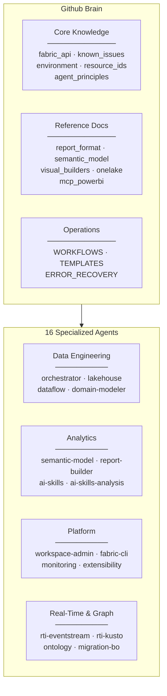

# Github Brain

**Shared knowledge base for building Microsoft Fabric solutions with AI agents.**

Accumulated patterns, API references, known issues, and 16 specialized agents — auto-loaded at session start to avoid re-learning lessons and repeating mistakes.


---

## Quick Start

This brain is auto-loaded via `.github/copilot-instructions.md` in any project that references it (`../Github_Brain/`). No manual setup required.

```
# In your project's .github/copilot-instructions.md:
# 1. Read ../Github_Brain/README.md
# 2. Read the relevant agent instructions.md for your task
# 3. Start working
```

---

## Architecture



---

## Knowledge Files

| File | Purpose |
|------|---------|
| [`agent_principles.md`](agent_principles.md) | **Mandatory** — Operating principles, task management, quality standards |
| [`fabric_api.md`](fabric_api.md) | REST API patterns, auth, async operations, LRO polling |
| [`report_format.md`](report_format.md) | **Critical** — Legacy PBIX format specification (the only format that renders) |
| [`visual_builders.md`](visual_builders.md) | Visual config structure, expression language, vcObjects |
| [`semantic_model.md`](semantic_model.md) | model.bim deployment, Direct Lake, TMDL |
| [`onelake.md`](onelake.md) | DFS API 3-step upload protocol |
| [`mcp_powerbi.md`](mcp_powerbi.md) | MCP Power BI — 21 tools for semantic model CRUD, DAX, Prep for AI |
| [`known_issues.md`](known_issues.md) | All gotchas, workarounds, what works vs what doesn't |
| [`environment.md`](environment.md) | Python, Azure CLI, PowerShell setup |
| [`resource_ids.md`](resource_ids.md) | GUIDs, endpoints, connection strings |
| [`WORKFLOWS.md`](WORKFLOWS.md) | 5 end-to-end cross-agent workflows |
| [`TEMPLATES.md`](TEMPLATES.md) | 6 project templates with checklists and time budgets |
| [`ERROR_RECOVERY.md`](ERROR_RECOVERY.md) | Error recovery playbook — decision trees, retry patterns |

---

## Agent Directory

### Data Engineering

| Agent | Scope | Docs |
|-------|-------|------|
| [orchestrator](agents/orchestrator-agent/) | Pipelines, Ingestion, Notebooks, Copy Jobs | [README](agents/orchestrator-agent/README.md) |
| [lakehouse](agents/lakehouse-agent/) | OneLake DFS, Delta Tables, Spark, Medallion | [README](agents/lakehouse-agent/README.md) |
| [dataflow](agents/dataflow-agent/) | Dataflow Gen2, Power Query M, ETL | [README](agents/dataflow-agent/README.md) |
| [domain-modeler](agents/domain-modeler-agent/) | Star Schema, Industry Templates, Data Gen | [README](agents/domain-modeler-agent/README.md) |

### Analytics & Reporting

| Agent | Scope | Docs |
|-------|-------|------|
| [semantic-model](agents/semantic-model-agent/) | DAX Measures, Relationships, model.bim, Direct Lake | [README](agents/semantic-model-agent/README.md) |
| [report-builder](agents/report-builder-agent/) | Power BI Reports, Visuals, Themes, Legacy PBIX | [README](agents/report-builder-agent/README.md) |
| [ai-skills](agents/ai-skills-agent/) | Fabric Data Agents, Instructions, Few-Shots | [README](agents/ai-skills-agent/README.md) |
| [ai-skills-analysis](agents/ai-skills-analysis-agent/) | Data Agent Evaluation, DAX Quality Scoring | [README](agents/ai-skills-analysis-agent/README.md) |

### Platform & Operations

| Agent | Scope | Docs |
|-------|-------|------|
| [workspace-admin](agents/workspace-admin-agent/) | Workspace CRUD, Capacity, RBAC, Git Integration | [README](agents/workspace-admin-agent/README.md) |
| [fabric-cli](agents/fabric-cli-agent/) | `fab` CLI, Item Management, CI/CD Deploy | [README](agents/fabric-cli-agent/README.md) |
| [monitoring](agents/monitoring-agent/) | Admin APIs, Audit Events, KQL Dashboards | [README](agents/monitoring-agent/README.md) |
| [extensibility-toolkit](agents/extensibility-toolkit-agent/) | Custom Workloads, iFrame SDK, Workload Hub | [README](agents/extensibility-toolkit-agent/README.md) |

### Real-Time Intelligence & Graph

| Agent | Scope | Docs |
|-------|-------|------|
| [rti-eventstream](agents/rti-eventstream-agent/) | EventStreams, EventHub SDK, CDC Patterns | [README](agents/rti-eventstream-agent/README.md) |
| [rti-kusto](agents/rti-kusto-agent/) | Eventhouse, KQL Database, Dashboards | [README](agents/rti-kusto-agent/README.md) |
| [ontology](agents/ontology-agent/) | Entity Types, Graph Model, GQL Queries | [README](agents/ontology-agent/README.md) |
| [migration-bo](agents/migration-bo-agent/) | Business Objects Migration to Fabric | [README](agents/migration-bo-agent/README.md) |

> Each agent has its own `instructions.md` (system prompt) and domain-specific knowledge files. The agent's README contains the full reading order for its domain.

---

## Repository Structure

```
Github_Brain/
├── README.md                    # This file
├── agent_principles.md          # Mandatory operating principles
├── fabric_api.md                # REST API patterns & auth
├── report_format.md             # Legacy PBIX format spec
├── visual_builders.md           # Visual config & expressions
├── semantic_model.md            # model.bim & Direct Lake
├── onelake.md                   # DFS API upload protocol
├── mcp_powerbi.md               # MCP PBI 21-tool reference
├── known_issues.md              # Gotchas & workarounds
├── environment.md               # Dev environment setup
├── resource_ids.md              # GUIDs & endpoints
├── WORKFLOWS.md                 # Cross-agent workflows
├── TEMPLATES.md                 # Project templates
├── ERROR_RECOVERY.md            # Error recovery playbook
└── agents/
    ├── orchestrator-agent/      # Pipelines & ingestion
    ├── lakehouse-agent/         # OneLake & Delta
    ├── dataflow-agent/          # Dataflow Gen2 & M
    ├── domain-modeler-agent/    # Star schema & data gen
    ├── semantic-model-agent/    # DAX & relationships
    ├── report-builder-agent/    # Power BI reports
    ├── ai-skills-agent/         # Fabric Data Agents
    ├── ai-skills-analysis-agent/# Agent evaluation
    ├── workspace-admin-agent/   # Workspace & capacity
    ├── fabric-cli-agent/        # CLI & CI/CD
    ├── monitoring-agent/        # Admin APIs & dashboards
    ├── extensibility-toolkit-agent/ # Custom workloads
    ├── rti-eventstream-agent/   # EventStreams & CDC
    ├── rti-kusto-agent/         # Eventhouse & KQL
    ├── ontology-agent/          # Graph & entities
    └── migration-bo-agent/      # BO migration
```

---

## Key Rule

> **The Fabric REST API accepts two report formats. Only one renders visuals.**
> Always use the **Legacy PBIX format** (`report.json` with `sections[].visualContainers[]`).
> Never use the PBIR folder format.

---

## License

MIT
