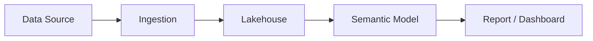
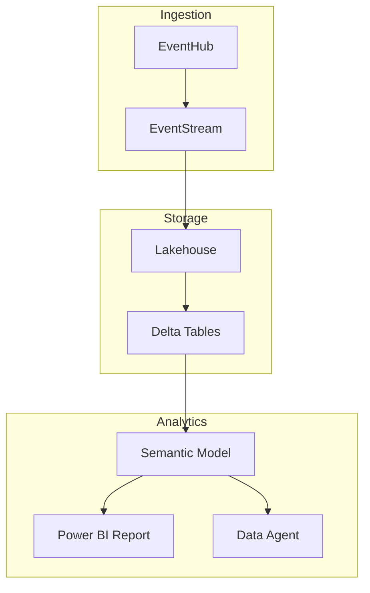

# README Best Practices — Section-by-Section Guide

## The 7-Second Rule

A visitor decides whether to stay or leave in ~7 seconds. Your README's first viewport must contain:
1. **Project name** — clear, memorable
2. **One-sentence description** — what it does (not how)
3. **Badges** — instant trust signals (license, build, version)
4. **Visual** — screenshot, diagram, or GIF

---

## Section Deep Dives

### 1. Title & Description

**Pattern:**
```markdown
# Project Name

One sentence: what the project does and who it's for.
```

**Good examples:**
```markdown
# FastAPI
Modern, fast web framework for building APIs with Python 3.7+

# Terraform
Infrastructure as Code to provision and manage any cloud, infrastructure, or service
```

**Anti-patterns:**
- ❌ "This is a project that..." — unnecessary filler
- ❌ Technical jargon in the first line — save it for Architecture
- ❌ Version history in the title area — use badges or CHANGELOG

---

### 2. Badges

Place badges immediately after the title. Group by category:

```markdown


```

**Recommended badge set (minimum 3):**
| Badge | Why |
|-------|-----|
| License | Legal clarity — #1 trust signal |
| Build/CI status | Shows the project is maintained |
| Version/Release | Shows maturity |
| Language/Framework | Quick tech identification |

**Style options:** `flat`, `flat-square`, `for-the-badge`, `plastic`
- Use `for-the-badge` for hero-style READMEs
- Use `flat` for minimal/clean READMEs

---

### 3. Hero Visual

**Options ranked by impact:**

| Type | Best for | Size guideline |
|------|----------|---------------|
| Demo GIF | CLI tools, UI apps | < 10 MB, 15-30 sec |
| Screenshot | Dashboards, UIs | ≤ 800px wide, PNG |
| Architecture diagram | Libraries, platforms | Mermaid (inline) or PNG |
| Terminal recording | CLI tools | asciicast or GIF |

**Mermaid diagram example (renders natively on GitHub):**
````markdown

````

**Image best practices:**
- Store in `docs/images/` or `assets/` — not the repo root
- Use relative paths: ``
- Add alt text for accessibility
- Compress images (tinypng.com, optipng) before committing

---

### 4. Table of Contents

**When to add:** README > 3 scroll-heights (~150 lines)

**Auto-generate with GitHub:** GitHub renders `[toc]` anchors from headers automatically.

**Manual pattern:**
```markdown
## Table of Contents
- [Features](#features)
- [Quick Start](#quick-start)
- [Prerequisites](#prerequisites)
- [Usage](#usage)
- [Architecture](#architecture)
- [Contributing](#contributing)
- [License](#license)
```

---

### 5. Features

Use a bullet list with emoji or bold lead-ins:

```markdown
## Features

- **Config-driven** — Define your project in YAML, not code
- **Idempotent** — Safe to re-run at any point
- **Multi-profile** — Support multiple environments (dev, staging, prod)
- **Extensible** — Plugin architecture for custom steps
```

**Anti-patterns:**
- ❌ Listing implementation details instead of user benefits
- ❌ More than 10 items — group into categories with sub-bullets

---

### 6. Quick Start

**The golden rule:** Clone → Install → Run in **≤ 5 commands**

```markdown
## Quick Start

```bash
git clone https://github.com/owner/repo.git
cd repo
pip install -r requirements.txt
cp .env.example .env        # configure your settings
python main.py              # open http://localhost:8000
```
```

**Rules:**
- Every command must be copy-pasteable
- Include expected output or "you should see..." guidance
- If prerequisites are needed, link to the Prerequisites section
- Never use pseudo-code (`<replace-this>`) without explaining what to replace

---

### 7. Prerequisites

Be explicit about versions:

```markdown
## Prerequisites

| Tool | Version | Install |
|------|---------|---------|
| Python | ≥ 3.10 | [python.org](https://python.org) |
| Node.js | ≥ 18 | [nodejs.org](https://nodejs.org) |
| Docker | ≥ 24 | [docker.com](https://docker.com) |
```

---

### 8. Usage / Examples

Show real commands with real output:

```markdown
## Usage

### Basic usage
```bash
python -m analyzer run --profile marketing360
```

### With options
```bash
python -m analyzer run --profile finance --html --refresh
```

### Expected output
```
Score: 93% (14/15 pass)
Duration: 191s
Report: results/Finance_Controller/20260327_194037/
```
```

---

### 9. Architecture

**Prefer Mermaid for maintainability:**
````markdown
## Architecture


````

---

## README Quality Checklist

Score your README (1 point each):

| # | Check | ✅/❌ |
|---|-------|------|
| 1 | Has one-line description | |
| 2 | Has ≥ 3 badges | |
| 3 | Has visual (screenshot/diagram/GIF) | |
| 4 | Has Quick Start ≤ 5 commands | |
| 5 | All commands are copy-pasteable | |
| 6 | Has prerequisites with versions | |
| 7 | Has usage examples | |
| 8 | Has Table of Contents (if long) | |
| 9 | Has Contributing section or link | |
| 10 | Has License | |
| 11 | No broken links or images | |
| 12 | No walls of text (uses tables/bullets) | |

**Score interpretation:**
- 10-12: Excellent — ready for public showcase
- 7-9: Good — minor gaps to fill
- 4-6: Needs work — missing key sections
- 0-3: Major rewrite needed

---

## Anti-Pattern Gallery

| Anti-Pattern | Why it's bad | Fix |
|-------------|-------------|-----|
| "This project is a..." opening | Wastes the first line | Lead with what it does |
| No visuals | Looks like abandoned homework | Add screenshot or Mermaid diagram |
| `npm install && npm run build && npm run migrate && ...` | Too many steps | Simplify with Makefile or docker-compose |
| Outdated screenshots | Erodes trust | Re-capture on each release |
| README.md is the only doc | Overloaded, hard to maintain | Split into docs/ folder |
| "See wiki for docs" (empty wiki) | Broken promise | Keep docs in-repo |
| Massive code blocks without context | Reader doesn't know why | Add a one-line comment before each block |
