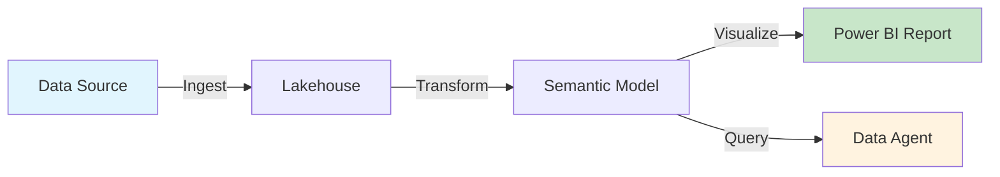
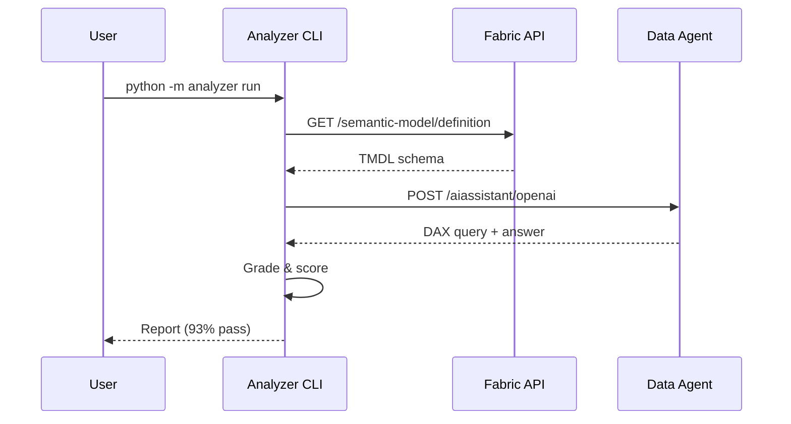
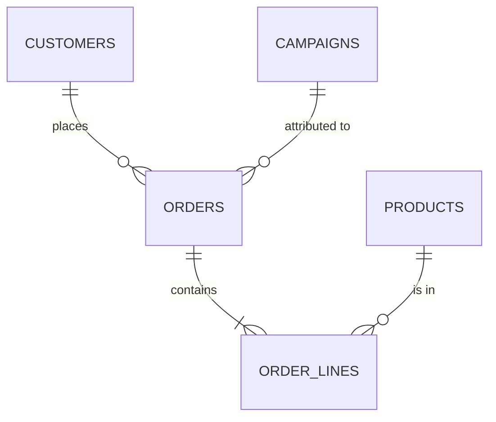
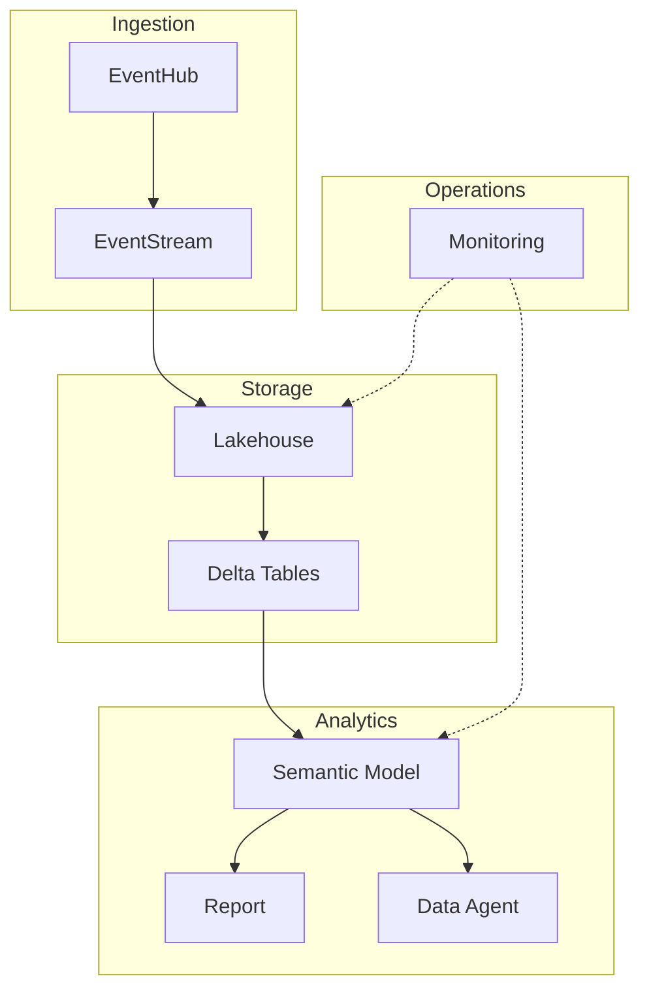

# Visual Presentation — Badges, Screenshots, Diagrams

## Badges

### shields.io Quick Reference

Base URL: `https://img.shields.io/badge/{label}-{message}-{color}`

**Styles:** `?style=flat` | `flat-square` | `for-the-badge` | `plastic`

### Dynamic Badges (auto-update from GitHub)

```markdown
<!-- Repository metadata -->


<!-- CI/CD -->


<!-- Package registries -->


```

### Static Badges (custom)

```markdown
<!-- Technology -->


<!-- Status -->


<!-- Counts -->


```

### Badge Placement Rules
- Place on the line **immediately after** the title and description
- Group by category: status → tech → metrics → CI
- Maximum 6-8 badges — more becomes visual noise
- Use consistent style across the same README

---

## Screenshots

### Capture Guidelines
| Rule | Details |
|------|---------|
| Resolution | Capture at 1x or 2x, resize to ≤ 800px wide |
| Format | PNG for UI, JPEG for photos, WebP for size optimization |
| Annotations | Use red rectangles/arrows to highlight key areas |
| Naming | `feature-name-screenshot.png` (kebab-case, descriptive) |
| Storage | `docs/images/` or `assets/` — never repo root |

### Embedding

```markdown
<!-- Simple -->


<!-- With link to full-size -->
[](docs/images/dashboard-full.png)

<!-- Centered (GitHub supports HTML) -->
<p align="center">
  
</p>

<!-- Side by side -->
<p align="center">
  
  
</p>
```

---

## Architecture Diagrams (Mermaid)

GitHub renders Mermaid natively — no image files needed.

### Flowchart (most common)

````markdown

````

### Sequence Diagram (API flows)

````markdown

````

### Entity Relationship (data models)

````markdown

````

### Subgraph Layout (platform architecture)

````markdown

````

---

## Demo GIFs & Videos

### GIF Recording Tools
| Tool | Platform | Notes |
|------|----------|-------|
| ScreenToGif | Windows | Best for short UI demos |
| LICEcap | Windows/Mac | Lightweight |
| Peek | Linux | Simple recorder |
| asciinema | Terminal | For CLI tools (embed or convert to GIF) |

### GIF Best Practices
- **Duration**: 15-30 seconds max
- **Size**: < 10 MB (GitHub will reject > 25 MB)
- **FPS**: 10-15 fps is sufficient
- **Resolution**: 800px wide max
- **Loop**: Should loop seamlessly
- **Speed**: Real-time or 1.5x — never faster

### Embedding Videos

```markdown
<!-- YouTube embed (thumbnail + link) -->
[](https://www.youtube.com/watch?v=VIDEO_ID)

<!-- GIF -->
<p align="center">
  
</p>
```

---

## Color Reference for Badges & Diagrams

| Use Case | Color | Hex |
|----------|-------|-----|
| Success / Active | brightgreen | `#4c1` |
| Warning / WIP | yellow | `#dfb317` |
| Error / Deprecated | red | `#e05d44` |
| Info / Neutral | blue | `#007ec6` |
| Microsoft Fabric | purple | `#742774` |
| Power BI | gold | `#F2C811` |
| Python | blue | `#3776AB` |
| TypeScript | blue | `#3178C6` |
